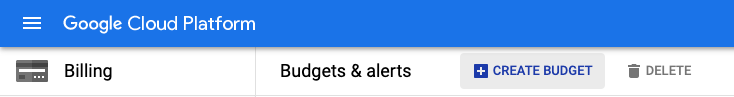
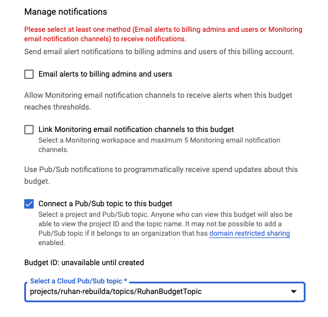
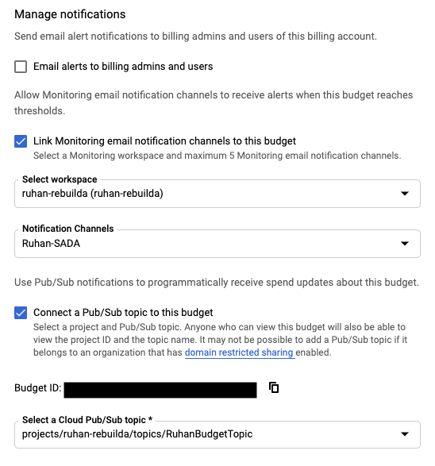
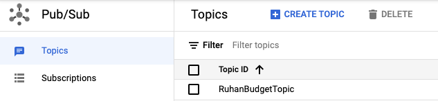
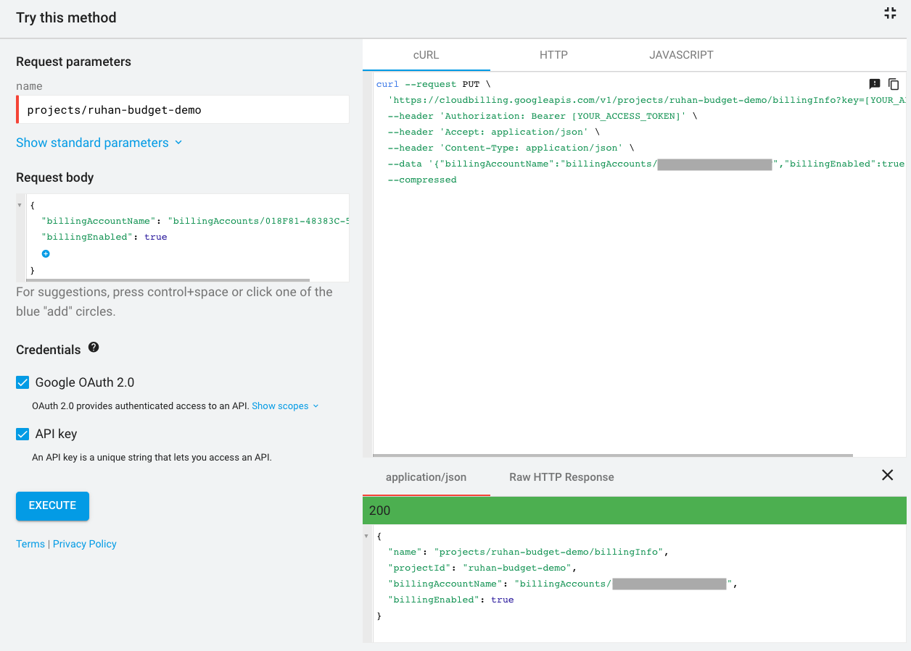
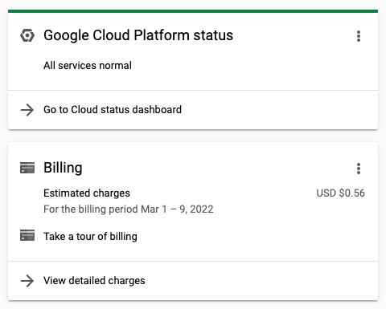
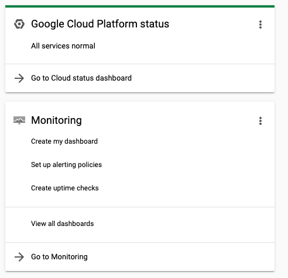

<p align=center vertical-align: middle; padding:20px 0;">
	
</p>

<center>

# CAP PROJECT USAGE WITH BUDGETS

This document will outline how to control costs related to sandbox projects on GCP. It involves setting a budget at the project level and programmatically disabling billing when a certain threshold is reached or the budget is consumed.

</center>

## Components
- Budgets
- Pub/Sub
- Cloud Functions
- Google Chat _(optional)_
> Interchangeable with most instant messaging platforms like Slack or Teams as long as it supports webhooks. 

- Monitoring workspace
> Create a workspace with specific email alerting channels to avoid sending these notifications to all billing admins or generic group email accounts. **It's also great if you dislike emails filling up your inbox...**

- Cloud Build _(optional)_
> This is great for creating a CI/CD pipeline to manage future development iterations of the function(s) being deployed. Unit testing, integration testing etc.

## Configuration
1. Create a new budget alert from the GCP billing console. It is **extremely important** that the budget name matches that of the project. For example: If my project was called ```project1```, my budget for that project also needs to be called ```project1```. For certain runtimes like Go or Python, you can leverage environment variables to extract project name, however this is not available for all runtimes at the time of writing. Having the project name linked to the budget is necessary to disable billing within our Cloud Function.   
	> **Note:** You will need to create a budget for each project you want to manage. For budget type, it would likely make the most sense to go with a specified amount.
	<p align=center>
		
	</p>
	
	> It is recommended to uncheck discounts and promotions to enable tracking of total cost. The main reasoning behind that is for predictability with regards to spending patterns. In addition, due to the fact that billing data is not available in real time, leaving discounts unchecked could help to offset potential overspending before the downstream Cloud Function can disable billing for the project.

2. Thresholds can be set according to your own requirements. A good starter formula would be to leverage 25% increments. 
3. For notifications, choose ```Connect a Pub/Sub topic to this budget``` and in the dropdown, create a new topic. The Pub/Sub topic can also be created prior to budget creation but is not necessary. In this step, make sure you choose the project where all resources are going to be deployed (Pub/Sub topic, Cloud Function etc.)

	<p align=center>
		
	</p>
	
4. You'll notice that you have to choose one of the email alerting channels. To limit noise to other billing admins, I recommend [setting up a workspace](https://cloud.google.com/monitoring/workspaces) with specific email accounts or even dummy emails if you prefer no emails. To get started, you can simply select the generic configuration as in the screenshot below.

	<p align=center>
		
	</p>
	
5. [Configure your Google chat](https://developers.google.com/hangouts/chat/quickstart/incoming-bot-node) for the incoming webhook. This is optional but can be used for example if you would like to alert based on budget thresholds being consumed or when billing has been disabled on a project. Below are code snippets for Slack and Google Chat integration.

	**Slack**
	
	```js
	// Webhook
	const fetch = require('node-fetch');
	
	const slackURL = '<YOUR-WEBHOOK-ENDPOINT>';
	const link = `<https://console.cloud.google.com/billing/${billingAccountId}|Go to Console>`;
	notification = `:ghost: ${link} *${budgetName}* :ghost: \nYour billing 
	account has exceeded the {threshold}%.\n>The billing account has accrued
	${costAmount} in costs so far for the month.`;
	            
	            const slackdata = JSON.stringify({
	                'text': notification,
	            });
	
	            // Post to Slack channel as per configured webhook
	            fetch(slackURL, {
	                method: 'POST',
	                headers: {
	                'Content-Type': 'application/json; charset=UTF-8',
	                },
	                body: slackdata,
	            });
	```
	
	**Google Chat**
	
	```js
	// Google Chat Notification
	// Webhook
	const fetch = require('node-fetch');
	
	const webhookURL = '<YOUR-WEBHOOK-ENDPOINT>';
	    
	// Construct a card notification
	const data = JSON.stringify({
	"cards": [
	{
	"header": {
	    "title": `${budgetName}`,
	    "subtitle": "ALERT",
	    "imageUrl": "https://storage.googleapis.com/logos/logo.png"
	},
	"sections": [
	    {
	    "widgets": [
	        {
	            "keyValue": {
	            "topLabel": "<b>Run rate this month</b>",
	            "content": `${costAmount} | Threshold: ${threshold}%`
	            }
	        }
	    ]
	    },
	    {
	    "widgets": [
	        {
	            "buttons": [
	                {
	                "textButton": {
	                    "text": "OPEN BILLING CONSOLE",
	                    "onClick": {
	                    "openLink": {
	                        "url": `https://console.cloud.google.com/billing/${billingAccountId}`
	                    }
	                    }
	                }
	                }
	            ]
	        }
	    ]
	    }
	]
	}
	]
	});
	    
	// Notification END
	
	// Post to Google Chat as per configured webhook
	            fetch(webhookURL, {
	                method: 'POST',
	                headers: {
	                'Content-Type': 'application/json; charset=UTF-8',
	                },
	                body: data,
	            }).then((response) => {
	                console.log(response);
	            });
	```

6. Once your new budget has been created, navigate to Pub/Sub on the GCP console and select the topic you created earlier. 

	<p align=center>
		
	</p>

	Once selected, choose ``` "+ TRIGGER CLOUD FUNCTION" ```. Give your new function a name and choose the region where it should be deployed.
	> **RECOMMENDATION**
	> Choose the region that matches your project region to avoid cross-region network traffic. Pub/Sub budget notifications are triggered on average every ~30 minutes
		
	> **PERMISSIONS**
	> The service account running the cloud function will need the following permissions in order to disable billing for the project:
	> ```resourcemanager.projects.deleteBillingAssignment``` on the project OR ```billing.resourceAssociations.delete``` on the Cloud Billing account. Assigning the _Project Billing Manager_ role to the relevant service account should work.
	
## Code

Below is the index.js content required for this function to run, along with the package.json configuration. You should not need to edit either of these unless customization is required (for example, adding IM alerts).

Essentially, this Cloud Function compares current spend against the set budget. When that threshold is exceeded, billing is automatically disabled for the project that triggered the Pub/Sub event.

> **NOTE**
> 
> To re-enable billing for the project, you will need to be a Billing Administrator for the billing account you're wanting to link to your project. Specifically, you need this permission: ```"permission": "billing.resourceAssociations.create"```
> The service account permissions configured earlier will not allow you to programmatically link a billing account to your project. The code snippet to enable billing is shared below.

### index.js

```js
/**
 * Triggered from a message on a Cloud Pub/Sub topic.
 *
 * @param {!Object} event Event payload.
 * @param {!Object} context Metadata for the event.
 */

const {CloudBillingClient} = require('@google-cloud/billing');

// [START functions_billing_stop]
const billing = new CloudBillingClient();

exports.stopBilling = async pubsubEvent => {
  const pubsubData = JSON.parse(Buffer.from(pubsubEvent.data, 'base64').toString());
  billingAccountId = pubsubEvent.attributes.billingAccountId;
  
    const PROJECT_ID = pubsubData.budgetDisplayName;
    const PROJECT_NAME = `projects/${PROJECT_ID}`;

    console.log(pubsubData);
    console.log(`Current Billing ID: ${billingAccountId}`);
    console.log('======================================');

  if (pubsubData.costAmount <= pubsubData.budgetAmount) {
    return console.log(`No action necessary. (Current cost: ${pubsubData.costAmount})`);
  }

  if (!PROJECT_ID) {
    return console.log('No project specified');
  }

  /**
  * Determine whether billing is enabled for a project
  * @param {string} projectName Name of project to check if billing is enabled
  * @return {bool} Whether project has billing enabled or not
  */
  const _isBillingEnabled = async projectName => {
    try {
      const [res] = await billing.getProjectBillingInfo({name: projectName});
      console.log({res});
      return res.billingEnabled;
    } catch (e) {
        console.log('Unable to determine if billing is enabled on specified project, assuming billing is enabled');
      return true;
    }
  };

  //==============Disable billing start================================
  /**
   * Disable billing for a project by removing its billing account
   * @param {string} projectName Name of project disable billing on
   * @return {string} Text containing response from disabling billing
   */
  const _disableBillingForProject = async projectName => {
    const [res] = await billing.updateProjectBillingInfo({
      name: projectName,
      resource: {billingAccountName: ''}, // Disable billing
    });
    return console.log(`Billing disabled: ${JSON.stringify(res)}`);
  };

  const billingEnabled = await _isBillingEnabled(PROJECT_NAME);
  if (billingEnabled) {
    return _disableBillingForProject(PROJECT_NAME);
  } else {
    return console.log('Billing already disabled');
  }
  //=============Disable billing end===================================
  
  //=============Enable billing start==================================
  /**
  * Uncomment this block when testing to re-enable billing for you project
  * 
  if (!(await _isBillingEnabled(PROJECT_NAME))) {
      // Enable billing
      const [response] = await billing.updateProjectBillingInfo({
        name: PROJECT_NAME,
        resource: {billingAccountName: 'billingAccounts/[YOUR_BILLING_ID]'},        
        });
      return console.log(`Billing enabled: ${JSON.stringify(response)}`);
    } else {
      return console.log('Billing already enabled');
    }
   */
  //=============Enable billing end====================================
};
```

### package.json

```json
{
  "name": "cloud-functions-billing",
  "version": "0.0.1",
  "description": "Disable billing with Cloud Functions and budgets",
  "main": "index.js",
  "engines": {
    "node": ">=12.0.0"
  },
  "dependencies": {
    "@google-cloud/billing": "^2.2.2",
    "@google-cloud/compute": "^3.1.0",
    "google-auth-library": "^7.0.0",
    "googleapis": "^95.0.0"
  }
}
```

### Example API call to re-enable billing

<p align=center>
		
	</p>

**Equivalent curl**

```sh
curl --request PUT \
  'https://cloudbilling.googleapis.com/v1/projects/ruhan-budget-demo/billingInfo?key=[YOUR_API_KEY]' \
  --header 'Authorization: Bearer [YOUR_ACCESS_TOKEN]' \
  --header 'Accept: application/json' \
  --header 'Content-Type: application/json' \
  --data '{"billingAccountName":"billingAccounts/[YOUR_BILLING_ID]","billingEnabled":true}' \
  --compressed
```

**Equivalent Javascript**

```js
<script src="https://apis.google.com/js/api.js"></script>
<script>
  /**
   * Sample JavaScript code for cloudbilling.projects.updateBillingInfo
   * See instructions for running APIs Explorer code samples locally:
   * https://developers.google.com/explorer-help/code-samples#javascript
   */

  function authenticate() {
    return gapi.auth2.getAuthInstance()
        .signIn({scope: "https://www.googleapis.com/auth/cloud-billing https://www.googleapis.com/auth/cloud-platform"})
        .then(function() { console.log("Sign-in successful"); },
              function(err) { console.error("Error signing in", err); });
  }
  function loadClient() {
    gapi.client.setApiKey("YOUR_API_KEY");
    return gapi.client.load("https://cloudbilling.googleapis.com/$discovery/rest?version=v1")
        .then(function() { console.log("GAPI client loaded for API"); },
              function(err) { console.error("Error loading GAPI client for API", err); });
  }
  // Make sure the client is loaded and sign-in is complete before calling this method.
  function execute() {
    return gapi.client.cloudbilling.projects.updateBillingInfo({
      "name": "projects/ruhan-budget-demo",
      "resource": {
        "billingAccountName": "billingAccounts/[YOUR_BILLING_ID]",
        "billingEnabled": true
      }
    })
        .then(function(response) {
                // Handle the results here (response.result has the parsed body).
                console.log("Response", response);
              },
              function(err) { console.error("Execute error", err); });
  }
  gapi.load("client:auth2", function() {
    gapi.auth2.init({client_id: "YOUR_CLIENT_ID"});
  });
</script>
<button onclick="authenticate().then(loadClient)">authorize and load</button>
<button onclick="execute()">execute</button>
```

## Impact
With billing enabled, you should see a representation similar to the below image on the console.
<p align=center>
		
	</p>
	
With billing disabled:
<p align=center>
		
	</p>

### Other observations
- Cloud Storage was still accessible even after billing was disabled. Resources in several buckets could still be downloaded
- Compute Engine was not accessible
- Kubernetes Engine was accessible, but all resources were shut down
- Cloud SQL was not accessible and the instance I had running was suspended.
- Cloud Logging is still accessible within the project, even with billing disabled. 
- Upon re-enabling billing, all instances and clusters automatically started back up and became accessible within minutes. This was not tested over multiple days, so results may vary depending on how long billing is disabled for your project. 

#### This solution is not recommended for production projects and should only be implemented in sandbox/dev type environments. 

## Resources

1. ProjectBillingInfo API Reference [docs](https://cloud.google.com/billing/docs/reference/rest/v1/ProjectBillingInfo)
2. API Explorer: [updateBillingInfo](https://cloud.google.com/billing/docs/reference/rest/v1/projects/updateBillingInfo)
3. [Examples](https://cloud.google.com/billing/docs/how-to/notify#set_up_budget_notifications) of automated cost control responses
4. [Manage billing for projects](https://cloud.google.com/billing/docs/how-to/modify-project)